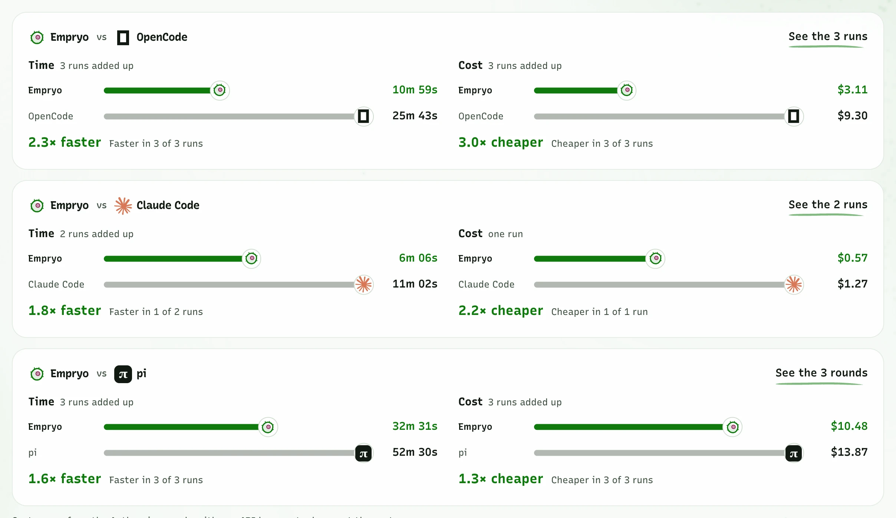

<div align="center">

<picture>
  <source media="(prefers-reduced-motion: reduce) and (prefers-color-scheme: dark)" srcset="assets/empryo-mote-dark.svg" />
  <source media="(prefers-reduced-motion: reduce)" srcset="assets/empryo-mote-light.svg" />
  <source media="(prefers-color-scheme: dark)" srcset="assets/epryo-mote-dark-normal.gif" />
  <source media="(prefers-color-scheme: light)" srcset="assets/empryo-mote-light-normal.gif" />
  
</picture>

# Empryo

Knows your code by heart.

[Download](https://empryo.com/download) · [Docs](https://empryo.com/docs) · [Benchmarks](https://empryo.com/benchmarks) · [Changelog](https://empryo.com/changelog) · [Discord](https://discord.gg/fX4H7GYSMJ)

<a href="https://discord.gg/fX4H7GYSMJ"></a>
<a href="https://x.com/BniWael"></a>

<picture>
  <source media="(prefers-color-scheme: dark)" srcset="assets/desktop-dark.webp" />
  <source media="(prefers-color-scheme: light)" srcset="assets/desktop-light.webp" />
  
</picture>

</div>

## Install

```bash
curl -fsSL https://empryo.com/install.sh | bash   # macOS, Linux
irm https://empryo.com/install.ps1 | iex          # Windows
```

Desktop app and installers: [empryo.com/download](https://empryo.com/download) only.

## What it does

- **It reads the map first.** It knows what an edit will touch before it makes it.
- **It edits by name.** A function or class, replaced exactly.
- **It checks its own work.** Typecheck, lint and tests, fixed in the same turn.
- **It remembers.** Decisions and past bugs, per project.

## Where Empryo stands

<div align="center">
<a href="https://empryo.com/benchmarks">
<picture>
  <source media="(prefers-color-scheme: dark)" srcset="assets/benchmark-dark.webp" />
  <source media="(prefers-color-scheme: light)" srcset="assets/benchmark-light.webp" />
  
</picture>
</a>

<sub>Every published run, added up. Shorter bars win. Checked against the bill. [All rounds](https://empryo.com/benchmarks)</sub>
</div>

## Desktop, terminal or headless

One agent, the same map and memory, wherever you run it.

<div align="center">
<picture>
  <source media="(prefers-color-scheme: dark)" srcset="assets/terminal-dark.webp" />
  <source media="(prefers-color-scheme: light)" srcset="assets/terminal-light.webp" />
  
</picture>
</div>

## Open core

This repository is the core and engine Empryo runs on, open source as SoulForge under its [license](LICENSE). The desktop app, the new surfaces and the newest features are Empryo's.

Bugs go to [Issues](https://github.com/proxysoul/soulforge/issues), ideas to [Discussions](https://github.com/proxysoul/soulforge/discussions).

## Sponsors

<div align="center">

<a href="https://llmgateway.io/dashboard?ref=6tjJR2H3X4E9RmVQiQwK" title="LLM Gateway">
  <picture>
    <source media="(prefers-color-scheme: dark)" srcset="assets/llmg-white.svg" />
    <source media="(prefers-color-scheme: light)" srcset="assets/llmg-dark.svg" />
    
  </picture>
</a>

<sub>[Sponsor on GitHub](https://github.com/sponsors/proxysoul) · [All backers](BACKERS.md)</sub>

</div>
